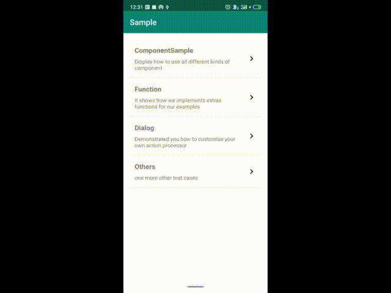

## AndroidSampleLibrary

> During the very critical moment. I made a plan for learning other computer languages. I was realized that I've lost a lot of source code.<br>
  After a finished one project or one part of the business. I forgot it immediately. That's why I just keep working on the Sample Library. Here is the fourth or fifth version of a test project.<br>
  I must say it's my favorite<br>

After one week of hard working. I've finished some functions:
* [Sample component](document/component/sampleComponent.md)
* [Sample function](document/function/sampleFunction.md)
* Action processor

#### [中文文档](document/readme-cn.md)


### Sample
[APK FILE](apk/app-debug.apk)


### Gradle

```
//Project:build.gradle ---------------
allprojects {
    repositories {
        maven{ url "http://www.momoda.pro:8081/repository/maven/"}
    }
}

//Project:app -------------

//For a kotlin project
apply plugin: 'kotlin-kapt'
dependencies {
    ...
    implementation "com.cz.android.sample.library:sample-library:1.0.0"
    kapt "com.cz.android.sample.processor:sample-processor:1.0.0"
}

//For a java andorid project
dependencies {
    ...
    implementation "com.cz.android.sample.library:sample-library:1.0.0"
    annotationProcessor "com.cz.android.sample.processor:sample-processor:1.0.0"
}


```

### Pictures

<br>
<br>

### Annotations
The [Annotations](document/annotations/sampleAnnotation.md)

### How to use

* Initialize you repository if you have. This will allow you demonstrate all the source code and document in this project

    ```
    @ProjectRepository("https://raw.githubusercontent.com/momodae/AndroidSampleLibrary/master/app/src/main/java/")
    class MainActivity : AppCompatActivity() {
        override fun onCreate(savedInstanceState: Bundle?) {
            super.onCreate(savedInstanceState)
            setContentView(R.layout.activity_main)
        }
    }
    ```

* Setup an exception handler. If your sample does not works properly. Here you could trace the exception and check it out

    ```

    val projectApplication = SampleApplication.getProjectApplication()
    projectApplication.androidSample.registerExceptionHandler { context, e, registerItem, item ->
        Log.e(TAG, "Exception occurs:" + e.message)
    }
    ```


* For an activity sample

    You could use either @Register or @RefRegister to set this sample up<br>
    !Most importantly you should extend from SampleAppCompatActivity.

    ```
    @RefRegister(title=R.string.component_sample3,desc=R.string.component_sample3_desc,category = R.string.component_category,priority = 2)
    class ComponentSourceSampleActivity : SampleAppCompatActivity() {
        override fun onCreate(savedInstanceState: Bundle?) {
            super.onCreate(savedInstanceState)
            setContentView(R.layout.activity_component_source_code_sample)
        }
    }
    ```

* For an fragment sample
    You could use either @Register or @RefRegister to set this sample up<br>

    ```
    @RefRegister(title=R.string.component_sample5,desc = R.string.component_sample5_desc,category = R.string.component_category)
    class ComponentSampleFragment : Fragment() {
        private var index=0
        override fun onCreateView(inflater: LayoutInflater, container: ViewGroup?, savedInstanceState: Bundle?): View? {
            return inflater.inflate(R.layout.fragment_component_sample, container, false);
        }
    }
    ```

* How to organize each samples

    First every samples belong to root. But if you setup your sample like this:<br>
    You actually changed the category of this sample<br>
    ```
    @RefRegister(xxx,category = R.string.component_category)<br>
    class Sample{
        ...
    }
    ```

    But if this category does not exist. The sample will be lost.

* How to use different kinds components

    ```
    //Mark each component annotation to this sample
    @SampleMessage
    @SampleMemory
    ...
    class Sample{
        ...
    }
    ```


### Problems

Sorry, I do know a lot of problems with this project. I just do all of this by myself during the Spring festival. I was working on this project for one week.
It's just the early version of this project. So issue me when you find a bug.

The problems that I knew was:

* The permission function not work properly.
* The source code list is not a tree, I should organize all the file as a tree.


### About me

A programmer in mainland China.

If you have any new idea about this project, feel free to contact me with this email:bingo110@126.com


